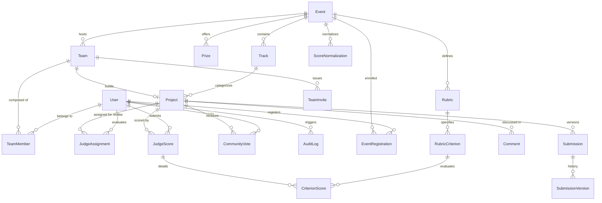

# Data Model Specification: Relational Schema & Entity Relationships

## 1. Overview
The platform uses a fully normalized relational database design enforcing foreign key constraints, unique constraints, appropriate indexes, timestamps (`created_at`, `updated_at`), and status enums to guarantee data integrity.

---

## 2. Entity Relationship Diagram (ERD)

---

## 3. Schema Definitions & Table Constraints

### 3.1 `users`
* `id`: VARCHAR(36) / UUID, Primary Key.
* `email`: VARCHAR(255), UNIQUE, NOT NULL, Indexed.
* `username`: VARCHAR(100), UNIQUE, NOT NULL, Indexed.
* `hashed_password`: VARCHAR(255), NOT NULL.
* `full_name`: VARCHAR(255), NOT NULL.
* `role`: VARCHAR(50), NOT NULL (`ADMIN`, `ORGANIZER`, `JUDGE`, `PARTICIPANT`).
* `bio`: TEXT, NULLABLE.
* `is_active`: BOOLEAN, DEFAULT TRUE.
* `created_at`: TIMESTAMP, NOT NULL.
* `updated_at`: TIMESTAMP, NOT NULL.

### 3.2 `events`
* `id`: VARCHAR(36), Primary Key.
* `title`: VARCHAR(255), NOT NULL.
* `slug`: VARCHAR(255), UNIQUE, NOT NULL, Indexed.
* `description`: TEXT, NOT NULL.
* `status_override`: VARCHAR(50), NULLABLE (e.g. `MANUAL_OVERRIDE` or null to derive from dates).
* `reg_start_date`: TIMESTAMP, NOT NULL.
* `reg_end_date`: TIMESTAMP, NOT NULL.
* `submission_start_date`: TIMESTAMP, NOT NULL.
* `submission_end_date`: TIMESTAMP, NOT NULL.
* `judging_start_date`: TIMESTAMP, NOT NULL.
* `judging_end_date`: TIMESTAMP, NOT NULL.
* `results_date`: TIMESTAMP, NOT NULL.
* `min_team_size`: INTEGER, DEFAULT 1.
* `max_team_size`: INTEGER, DEFAULT 4.
* `voting_enabled`: BOOLEAN, DEFAULT FALSE.
* `voting_start_date`: TIMESTAMP, NULLABLE.
* `voting_end_date`: TIMESTAMP, NULLABLE.
* `votes_per_user`: INTEGER, DEFAULT 3.
* `hide_live_voting_results`: BOOLEAN, DEFAULT TRUE.
* `created_by_id`: VARCHAR(36), Foreign Key (`users.id`).
* `created_at`: TIMESTAMP, NOT NULL.
* `updated_at`: TIMESTAMP, NOT NULL.

### 3.3 `tracks` & `prizes`
* **`tracks`**: `id`, `event_id` (FK), `name`, `description`, `created_at`.
* **`prizes`**: `id`, `event_id` (FK), `track_id` (FK, NULLABLE), `title`, `description`, `amount_usd`, `created_at`.

### 3.4 `teams`, `team_members`, `team_invites`
* **`teams`**:
  - `id`: VARCHAR(36), Primary Key.
  - `event_id`: VARCHAR(36), Foreign Key (`events.id`), Indexed.
  - `name`: VARCHAR(255), NOT NULL.
  - `description`: TEXT, NULLABLE.
  - `leader_id`: VARCHAR(36), Foreign Key (`users.id`).
  - `invite_code`: VARCHAR(64), UNIQUE, NOT NULL, Indexed.
  - `created_at`: TIMESTAMP, NOT NULL.
  - UNIQUE(`event_id`, `name`).
* **`team_members`**:
  - `id`: VARCHAR(36), Primary Key.
  - `team_id`: VARCHAR(36), Foreign Key (`teams.id`, ON DELETE CASCADE).
  - `user_id`: VARCHAR(36), Foreign Key (`users.id`, ON DELETE CASCADE).
  - `role`: VARCHAR(50), DEFAULT 'MEMBER' (`LEADER`, `MEMBER`).
  - `joined_at`: TIMESTAMP, NOT NULL.
  - UNIQUE(`team_id`, `user_id`).
* **`team_invites`**:
  - `id`: VARCHAR(36), Primary Key.
  - `team_id`: VARCHAR(36), Foreign Key (`teams.id`).
  - `email`: VARCHAR(255), NOT NULL.
  - `status`: VARCHAR(50) (`PENDING`, `ACCEPTED`, `REJECTED`, `EXPIRED`).
  - `created_at`: TIMESTAMP, NOT NULL.

### 3.5 `projects`, `submissions`, `submission_versions`
* **`projects`**:
  - `id`: VARCHAR(36), Primary Key.
  - `team_id`: VARCHAR(36), Foreign Key (`teams.id`), UNIQUE, NOT NULL.
  - `event_id`: VARCHAR(36), Foreign Key (`events.id`), NOT NULL, Indexed.
  - `track_id`: VARCHAR(36), Foreign Key (`tracks.id`), NULLABLE.
  - `title`: VARCHAR(255), NOT NULL.
  - `tagline`: VARCHAR(255), NULLABLE.
  - `description`: TEXT, NOT NULL.
  - `github_url`: VARCHAR(500), NULLABLE.
  - `demo_url`: VARCHAR(500), NULLABLE.
  - `video_url`: VARCHAR(500), NULLABLE.
  - `technologies`: TEXT, NULLABLE (JSON string list).
  - `logo_url`: VARCHAR(500), NULLABLE.
  - `is_published`: BOOLEAN, DEFAULT TRUE.
  - `created_at`: TIMESTAMP, NOT NULL.
  - `updated_at`: TIMESTAMP, NOT NULL.
* **`submissions`**:
  - `id`: VARCHAR(36), Primary Key.
  - `project_id`: VARCHAR(36), Foreign Key (`projects.id`), UNIQUE, NOT NULL.
  - `status`: VARCHAR(50) (`DRAFT`, `SUBMITTED`, `LOCKED`, `UNDER_REVIEW`, `FINALIZED`).
  - `submitted_at`: TIMESTAMP, NULLABLE.
  - `created_at`: TIMESTAMP, NOT NULL.
  - `updated_at`: TIMESTAMP, NOT NULL.
* **`submission_versions`**:
  - `id`: VARCHAR(36), Primary Key.
  - `submission_id`: VARCHAR(36), Foreign Key (`submissions.id`).
  - `version_number`: INTEGER, NOT NULL.
  - `payload_snapshot`: TEXT, NOT NULL (JSON serialization of project state).
  - `created_at`: TIMESTAMP, NOT NULL.

### 3.6 `rubrics` & `rubric_criteria`
* **`rubrics`**:
  - `id`: VARCHAR(36), Primary Key.
  - `event_id`: VARCHAR(36), Foreign Key (`events.id`), UNIQUE, NOT NULL.
  - `name`: VARCHAR(255), NOT NULL.
  - `is_active`: BOOLEAN, DEFAULT TRUE.
  - `version`: INTEGER, DEFAULT 1.
  - `created_at`: TIMESTAMP, NOT NULL.
* **`rubric_criteria`**:
  - `id`: VARCHAR(36), Primary Key.
  - `rubric_id`: VARCHAR(36), Foreign Key (`rubrics.id`, ON DELETE CASCADE).
  - `name`: VARCHAR(255), NOT NULL.
  - `description`: TEXT, NULLABLE.
  - `weight`: FLOAT, NOT NULL (e.g. 0.30 for 30%).
  - `max_score`: FLOAT, DEFAULT 10.0.
  - `sort_order`: INTEGER, DEFAULT 0.
  - `is_active`: BOOLEAN, DEFAULT TRUE.

### 3.7 `judge_assignments`, `judge_scores`, `criterion_scores`
* **`judge_assignments`**:
  - `id`: VARCHAR(36), Primary Key.
  - `event_id`: VARCHAR(36), Foreign Key (`events.id`), NOT NULL.
  - `judge_id`: VARCHAR(36), Foreign Key (`users.id`), NOT NULL, Indexed.
  - `project_id`: VARCHAR(36), Foreign Key (`projects.id`), NOT NULL, Indexed.
  - `status`: VARCHAR(50) DEFAULT 'PENDING' (`PENDING`, `COMPLETED`, `EXCUSED`).
  - `assigned_at`: TIMESTAMP, NOT NULL.
  - UNIQUE(`judge_id`, `project_id`).
* **`judge_scores`**:
  - `id`: VARCHAR(36), Primary Key.
  - `assignment_id`: VARCHAR(36), Foreign Key (`judge_assignments.id`), UNIQUE, NOT NULL.
  - `judge_id`: VARCHAR(36), Foreign Key (`users.id`), NOT NULL.
  - `project_id`: VARCHAR(36), Foreign Key (`projects.id`), NOT NULL.
  - `rubric_id`: VARCHAR(36), Foreign Key (`rubrics.id`), NOT NULL.
  - `raw_total_score`: FLOAT, NOT NULL.
  - `weighted_total_score`: FLOAT, NOT NULL.
  - `feedback`: TEXT, NULLABLE.
  - `is_finalized`: BOOLEAN, DEFAULT FALSE.
  - `submitted_at`: TIMESTAMP, NOT NULL.
  - `updated_at`: TIMESTAMP, NOT NULL.
* **`criterion_scores`**:
  - `id`: VARCHAR(36), Primary Key.
  - `score_id`: VARCHAR(36), Foreign Key (`judge_scores.id`, ON DELETE CASCADE).
  - `criterion_id`: VARCHAR(36), Foreign Key (`rubric_criteria.id`).
  - `raw_score`: FLOAT, NOT NULL.
  - `max_score`: FLOAT, NOT NULL.
  - `weight`: FLOAT, NOT NULL.
  - `weighted_score`: FLOAT, NOT NULL.

### 3.8 `score_normalizations`
* `id`: VARCHAR(36), Primary Key.
* `event_id`: VARCHAR(36), Foreign Key (`events.id`), NOT NULL, Indexed.
* `project_id`: VARCHAR(36), Foreign Key (`projects.id`), NOT NULL, Indexed.
* `evaluations_count`: INTEGER, NOT NULL.
* `raw_average_score`: FLOAT, NOT NULL.
* `normalized_z_score`: FLOAT, NOT NULL.
* `normalized_final_score`: FLOAT, NOT NULL (rescaled 0-100).
* `raw_rank`: INTEGER, NOT NULL.
* `normalized_rank`: INTEGER, NOT NULL.
* `computed_at`: TIMESTAMP, NOT NULL.
* UNIQUE(`event_id`, `project_id`).

### 3.9 `community_votes`, `comments`, `audit_logs`, `certificates`, `webhooks`
* **`community_votes`**: `id`, `event_id`, `project_id`, `user_id`, `ip_address`, `user_agent`, `created_at`. UNIQUE(`user_id`, `project_id`).
* **`comments`**: `id`, `project_id`, `user_id`, `content`, `is_moderated`, `created_at`.
* **`audit_logs`**: `id`, `user_id` (NULLABLE), `action`, `resource_type`, `resource_id`, `details` (JSON), `ip_address`, `created_at`.
* **`certificates`**: `id` (UUID), `event_id`, `user_id`, `team_id`, `recipient_name`, `cert_type` (`PARTICIPANT`, `WINNER`, `JUDGE`), `achievement`, `issue_date`, `verification_hash`.
* **`webhooks`**: `id`, `event_id`, `target_url`, `secret_token`, `events_subscribed` (JSON list), `is_active`, `created_at`.
